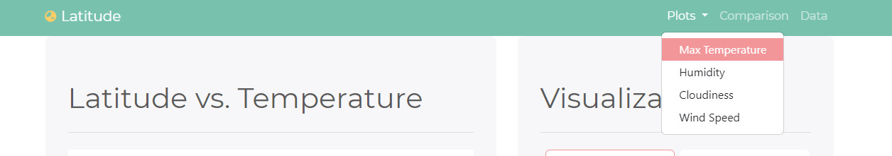

# web-design-challenge - Web Visualization Dashboard
 Jamie Tan web design challenge submission

### Background of the challenge:

Data is more powerful when we share it with others! We are required to apply what we have learnt on HTML and CSS to create a dashboard showing off the analysis we've done. Using bootstrap, the website is built to be responsive and is deployed on [GitHub pages.](https://jamie-gihu.github.io/web-design-challenge/WebVisualizations/)

### Additional features:
* Application of bootstrap theme from [Bootswatch](https://bootswatch.com/) (I picked Minty coz it's fresh)
* Usage of glyphicons from [fontawesome](https://fontawesome.com/)
* Button to allow users to download data table as csv file
* Easier navigation - 1-click to return to top of page

### Submission:
1. HTML files x 7 (1 Landing Page, 4 Visualization Pages, 1 Comparison Page and 1 Data Page)
2. Screenshots (in folder 'visualizations')
3. Published website [here](https://jamie-gihu.github.io/web-design-challenge/WebVisualizations/)

#### Nav Bar
Large Screen

Small Screen

#### Landing Page

Large Screen

Small Screen

#### Visualization Pages

Large Screen

Small Screen

#### Comparison Page

Large Screen

Small Screen

#### Data Page

Large Screen

Small Screen

